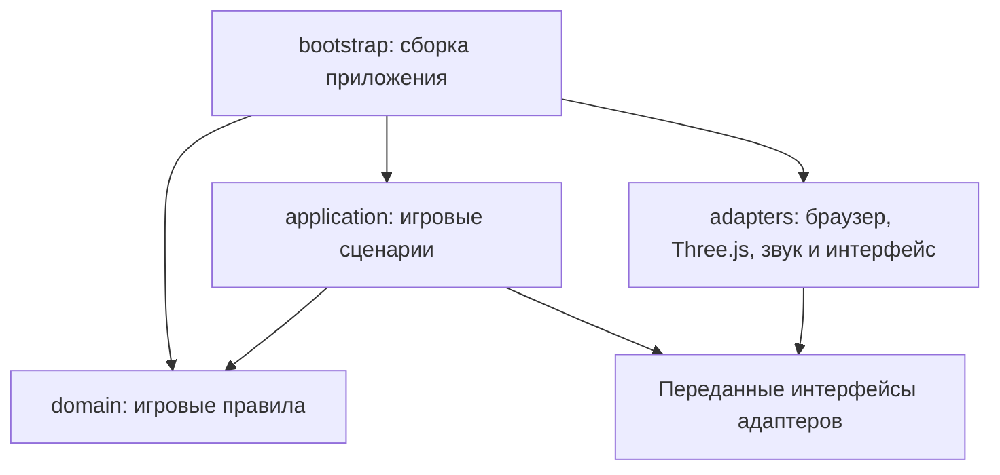

# Архитектура и правила разработки

Игровые правила, сценарии и браузерные реализации имеют отдельные обязанности. Игра сохраняет запуск двойным щелчком по `index.html`: для обычных скриптов используется небольшой реестр фабрик `TBS`. Сборка модулей находится в `src/bootstrap/`.



Внутренние слои не импортируют браузерные реализации. Сценарий кадра получает интерфейсы через аргументы; `bootstrap` передаёт ему конкретные адаптеры. Тесты выполняют те же сценарии с простыми заменами этих интерфейсов.

## Игровые правила

`src/domain/` содержит состояние смены, неизменяемые настройки, дорожную сеть, физику игрока, столкновения, транспорт и задания. В этих файлах нет `window`, DOM, Three.js, аудио или таймеров браузера. ESLint проверяет это ограничение, а тест загружает все внутренние модули в среде без браузерных глобальных объектов.

Физика принимает координаты других автомобилей и возвращает события `impact` и `recharged`. Она не создаёт 3D-объекты и не показывает сообщения. Транспорт рассчитывает собственные координаты, скорости и фазу светофоров; адаптер связывает идентификаторы автомобилей с их моделями. Правила заданий меняют прогресс и возвращают результат взаимодействия с грузом.

Состояние игры содержит режим, прогресс заданий, игрока и управление. Время визуальных эффектов, освещение, сила удара и анимация запуска дрона находятся в отдельном состоянии представления. Настройки карты и заданий рекурсивно защищены от изменения.

## Сценарии и интерфейсы

`src/application/` отвечает за старт и паузу смены, последовательность обновления кадра и взаимодействие с заданием. Эти модули получают только необходимые данные и интерфейсы.

| Интерфейс          | Методы                                                                 | Ответственность                                |
| ------------------ | ---------------------------------------------------------------------- | ---------------------------------------------- |
| Физика             | `updatePhysics(dt)`                                                    | Движение игрока и события столкновения/зарядки |
| Транспорт          | `advanceTraffic(dt)`                                                   | Расчёт движения других машин                   |
| Звук               | `beginSound()`, `advance(dt)`, `impact(speed)`, `updateSound(braking)` | Воспроизведение и обновление звука             |
| Маяки              | `launch(point)`, `updateMarkers(dt)`                                   | Отображение целей и эффекта взаимодействия     |
| Уведомления        | `showToast(message)`                                                   | Сообщение игроку                               |
| Экран паузы        | `hide()`, `showPaused(title)`                                          | Представление состояния смены                  |
| Графика            | `render(dt, daylight)`                                                 | Отображение кадра                              |
| Часы и планировщик | `now()`, `request(callback)`, `cancel(id)`                             | Измерение времени и запуск следующего кадра    |

Браузерный планировщик ограничивает шаг до 50 мс, пропускает скрытую вкладку и сбрасывает время при продолжении игры. Игровой сценарий замораживает физику и движение трафика на паузе. Нажатые клавиши сбрасываются при потере фокуса и переходе на паузу.

## Графика и сборка города

Адаптеры находятся в `src/adapters/`. Геометрические координаты и размеры являются данными моделей. Сложные объекты строятся из отдельных частей: материалы, форма, внешние детали, салон, колёса, свет и оформление. Здания разделены на оболочку, окна, крышу, вход, витрины и детали назначения. Центральный квартал собирается из основания, стен, окон, крыши, павильона, озеленения и освещения.

Машина игрока и обычный транспорт имеют отдельные конструкторы `createHeroCar()` и `createTrafficCar(color, variant)`. Недостижимые ветки старой машины удалены. Совпадение геометрии, материалов и положения всех 11 877 объектов сцены проверено сравнением с сохранённой версией до изменения архитектуры.

## Применение принципов

| Принцип                       | Как применяется в проекте                                                                                                  |
| ----------------------------- | -------------------------------------------------------------------------------------------------------------------------- |
| Code Style и Coding Standards | Prettier, EditorConfig, правила ESLint и общая команда проверки                                                            |
| Чистый код                    | Именованные зависимости, явные результаты действий, небольшие игровые операции и удаление неиспользуемых веток             |
| Разделение ответственности    | Движение не воспроизводит звук, задания не создают DOM, транспорт не хранит 3D-модели                                      |
| Архитектура                   | `domain`, `application`, `adapters` и отдельная сборка `bootstrap`                                                         |
| SOLID                         | Одна обязанность модулей, небольшие интерфейсы и передача реализаций через аргументы; замена адаптеров проверяется тестами |
| Clean Architecture            | Независимые игровые правила и сценарии, внешние реализации графики/звука/браузера                                          |
| Паттерны                      | Фабрики модулей, адаптеры, внедрение зависимостей и результаты событий физики                                              |

Проект использует функции и фабрики. Принципы наследования применимы при появлении иерархий классов. Новый паттерн добавляется для конкретной задачи; простая функция не требует дополнительной иерархии или слоя.

## Стиль и проверки

Используйте `camelCase` для функций и переменных, `const` для неизменяемых ссылок, `let` для переназначаемых значений и строгие сравнения. Передавайте зависимости именованными свойствами. Называйте игровые действия по их назначению. Локальные геометрические координаты `x`, `y`, `z`, ширина `w` и глубина `d` допустимы внутри построения моделей. Комментарии объясняют причину решения или единицы измерения.

Prettier отвечает за отступы, переносы, кавычки и оформление JS, HTML, CSS, JSON и Markdown. ESLint отвечает за ошибки JavaScript, неиспользуемые аргументы, небезопасные конструкции, сложность игровых операций и границы слоёв. Правила форматирования не дублируются в ESLint.

```sh
npm run format
npm run lint
npm run check
npm run test:browser
```

ESLint запускается с нулевым допуском предупреждений. Во внутренних слоях ограничены вложенность, количество инструкций в функции и сложность ветвления. Сгенерированные данные, сторонний Three.js, зависимости и результаты проверок исключены из анализа и форматирования.

`npm run check` включает анализ, проверку форматирования и 23 теста. Они проверяют доставку, награды, паузу, физику, зарядку, дорожный трафик, светофоры, управление, камеру, планировщик и архитектурные ограничения. Браузерная проверка охватывает автономный запуск, движение, настройки, изменение размера экрана и сенсорное управление. GitHub Actions запускает `npm run check` для push и pull request после публикации изменений в репозитории.

## Добавление функциональности

1. Поместите правило, которое можно проверить по обычным данным, в `domain`.
2. Координацию нескольких действий поместите в `application` и передайте нужные интерфейсы через аргументы.
3. Работу с браузером, аудио или Three.js реализуйте в адаптере.
4. Подключите модуль в `index.html` и передайте реализации в `bootstrap`.
5. При изменении правил добавьте проверку ожидаемого поведения и выполните `npm run check`. При изменении взаимодействия с браузером или графики выполните также `npm run test:browser`.

Новая реализация адаптера должна сохранять контракт его методов. Для проверки правил используйте простые заменяемые интерфейсы без создания браузера или 3D-сцены.
